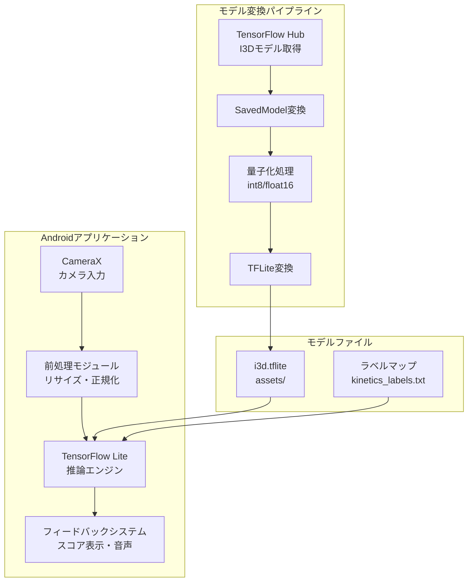
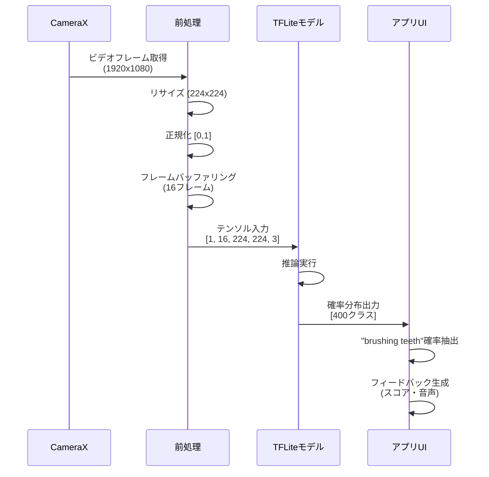

# Android歯磨き認識モデル設計ドキュメント

## 1. 概要・目的

### 1.1 プロジェクトの目的と背景

本プロジェクトは、子供向け歯磨きアプリケーションにおいて、リアルタイムで歯磨き動作を認識・評価するための機械学習モデル統合を目的としています。既存の大規模データセットで学習済みの認識モデルを活用することで、追加のデータ収集や学習コストを最小限に抑えながら、高精度な動作認識を実現します。

### 1.2 対象ユーザー

- **主要ターゲット**: 子供向け歯磨きアプリの開発者
- **用途**: 歯磨き動作のリアルタイム認識とフィードバック提供
- **動作環境**: Android 15以降のモバイルデバイス

### 1.3 技術スタック概要

- **モデルフレームワーク**: TensorFlow Lite 2.14.0
- **変換ツール**: TensorFlow Hub, ONNX Runtime (NTUモデル用)
- **Android開発**: CameraX, TensorFlow Lite Support Library
- **開発環境**: Python (uv管理), Android Studio
- **コスト**: すべて無料（オープンソースツールのみ使用）

## 2. モデル選択と比較

### 2.1 I3D (Inflated 3D ConvNet) from Kinetics

#### アーキテクチャ説明

I3Dは、DeepMindが開発した3D畳み込みニューラルネットワーク（3D CNN）です。2D CNNのフィルタとプーリングカーネルを3D空間に拡張することで、時間次元を含む動画の特徴を効果的に抽出します。

**主要特徴**:
- **入力形式**: ビデオクリップ（複数フレーム）
- **推奨入力サイズ**: 224×224ピクセル、16フレーム以上
- **アーキテクチャ**: Inception-v1ベースの3D拡張
- **出力**: Kinetics-400/600クラスの確率分布

#### データセット（Kinetics-400/600）

- **Kinetics-400**: 400種類のアクションクラスを含む大規模データセット
- **Kinetics-600**: 600種類のアクションクラスに拡張
- **"brushing teeth"クラス**: 両データセットに含まれる
- **データソース**: YouTube動画から抽出
- **学習済みモデル**: TensorFlow Hubで公開

#### "brushing teeth"クラスの認識能力

- **精度**: KineticsデータセットでのTop-1精度は約70-75%（全体平均）
- **特徴**: 手の動きと口元の動きを同時に認識
- **適用性**: 子供の歯磨き動作にも適用可能（ファインチューニング推奨）

#### モデルサイズとパフォーマンス特性

| 項目 | 値 |
|------|-----|
| 元のモデルサイズ | 約300-500MB (float32) |
| 量子化後サイズ | 約75-125MB (int8) |
| 推論速度（CPU） | 約100-200ms/クリップ（16フレーム） |
| 推論速度（GPU/NNAPI） | 約30-50ms/クリップ |
| メモリ使用量 | 約200-300MB（実行時） |

### 2.2 NTU RGB+Dベースモデル

#### アーキテクチャ説明

NTU RGB+Dは、骨格情報（RGB画像 + 深度情報 + 骨格データ）を活用した行動認識データセットです。複数のアーキテクチャが提案されており、主に以下のタイプがあります：

- **CNNベース**: RGB画像を入力とする2D/3D CNN
- **GNNベース**: 骨格データをグラフとして処理するGraph Neural Network
- **マルチモーダル**: RGB + 骨格情報を統合

#### "brush teeth"アクション認識

- **データセット**: NTU RGB+D 60/120（60種類または120種類のアクション）
- **"brush teeth"クラス**: データセットに含まれる
- **特徴**: 骨格情報を活用することで、より正確な動作認識が可能
- **制約**: 骨格検出が必要なため、追加の処理パイプラインが必要

#### PyTorch/TensorFlow実装の違い

| 項目 | PyTorch実装 | TensorFlow実装 |
|------|------------|----------------|
| 入手容易性 | GitHubで多数公開 | やや少ない |
| TFLite変換 | ONNX経由で変換必要 | 直接変換可能 |
| 変換の複雑さ | 中程度（ONNX→TFLite） | 低（直接変換） |
| コミュニティ | 活発 | やや少ない |

### 2.3 モデル比較表

| 項目 | I3D (Kinetics) | NTU RGB+Dベース |
|------|----------------|-----------------|
| **モデルサイズ（量子化後）** | 75-125MB | 50-100MB（CNNベース） |
| **精度** | 高（Kineticsデータセット） | 高（NTUデータセット） |
| **変換容易性** | 高（TensorFlow Hub直接） | 中（PyTorch→ONNX→TFLite） |
| **モバイル適合性** | 中（サイズが大きい） | 高（軽量版あり） |
| **リアルタイム性能** | 中（NNAPIで改善可能） | 高（軽量アーキテクチャ） |
| **データ要件** | RGB動画のみ | RGB + 骨格（オプション） |
| **推奨用途** | 高精度が必要な場合 | 軽量性が重要な場合 |

**推奨**: 初回実装はI3Dを推奨（入手容易性と変換の簡単さ）。パフォーマンスが課題の場合はNTU RGB+Dベースの軽量モデルを検討。

## 3. システムアーキテクチャ

### 3.1 全体アーキテクチャ図



### 3.2 データフロー



### 3.3 コンポーネント構成

#### 3.3.1 モデル変換モジュール（Python）

**役割**: TensorFlow Hubから取得したI3DモデルをTFLite形式に変換

**主要コンポーネント**:
- モデルダウンロード（TensorFlow Hub）
- SavedModel形式への変換
- 量子化処理（int8/float16）
- TFLite形式への変換
- モデル検証

**実行環境**: Python 3.9+、TensorFlow 2.14.0+

#### 3.3.2 Android統合モジュール

**役割**: TFLiteモデルをAndroidアプリに統合し、リアルタイム推論を実行

**主要コンポーネント**:
- CameraX統合（ビデオストリーム取得）
- フレーム前処理（リサイズ、正規化）
- TensorFlow Lite Interpreter
- ラベルマップ管理
- フィードバックUI

**実行環境**: Android 15+、CameraX 1.3+

#### 3.3.3 リアルタイム処理パイプライン

**処理フロー**:
1. **フレーム取得**: CameraXから30fpsでフレームを取得
2. **バッファリング**: 16フレームをバッファに蓄積
3. **前処理**: 224×224にリサイズ、[0,1]に正規化
4. **推論**: TFLite Interpreterで推論実行（非同期）
5. **後処理**: "brushing teeth"クラスの確率を抽出
6. **フィードバック**: UI更新、音声フィードバック（オプション）

**パフォーマンス目標**:
- 推論レイテンシ: 100ms以下（NNAPI使用時）
- フレームレート: 15-30fps（推論を含む）

## 4. モデル変換設計

### 4.1 TensorFlow HubからのI3D取得手順

#### 4.1.1 モデルURL

```
https://tfhub.dev/deepmind/i3d-kinetics-400/1
```

#### 4.1.2 取得方法

**Pythonコード例**:
```python
import tensorflow as tf
import tensorflow_hub as hub

# モデルをロード
model_url = "https://tfhub.dev/deepmind/i3d-kinetics-400/1"
model = hub.load(model_url)
```

### 4.2 SavedModel形式への変換プロセス

#### 4.2.1 変換の必要性

TensorFlow Hubのモデルは直接TFLiteに変換できない場合があるため、まずSavedModel形式に変換します。

#### 4.2.2 変換手順

**Pythonコード例**:
```python
import tensorflow as tf
import tensorflow_hub as hub

# モデルロード
model_url = "https://tfhub.dev/deepmind/i3d-kinetics-400/1"
i3d_model = hub.load(model_url)

# シグネチャを取得（通常は'default'）
model_signature = i3d_model.signatures['default']

# テスト入力を作成（形状: [batch, frames, height, width, channels]）
# I3Dは通常16フレームを入力とする
test_input = tf.zeros((1, 16, 224, 224, 3), dtype=tf.float32)

# 推論を実行してモデルをトレース
_ = model_signature(test_input)

# SavedModelとして保存
saved_model_path = './i3d_saved_model'
tf.saved_model.save(i3d_model, saved_model_path)
```

### 4.3 TensorFlow Liteへの変換手順

#### 4.3.1 基本変換

**Pythonコード例**:
```python
import tensorflow as tf

# SavedModelからTFLiteコンバーターを作成
converter = tf.lite.TFLiteConverter.from_saved_model('./i3d_saved_model')

# TFLiteモデルに変換
tflite_model = converter.convert()

# ファイルに保存
with open('i3d.tflite', 'wb') as f:
    f.write(tflite_model)
```

#### 4.3.2 量子化オプション

**int8量子化（推奨）**:
```python
converter = tf.lite.TFLiteConverter.from_saved_model('./i3d_saved_model')

# 量子化を有効化
converter.optimizations = [tf.lite.Optimize.DEFAULT]

# 代表データセットを提供（オプション、精度向上のため）
def representative_dataset():
    # 実際のデータサンプルを使用
    for _ in range(100):
        yield [tf.random.normal((1, 16, 224, 224, 3))]

converter.representative_dataset = representative_dataset
converter.target_spec.supported_ops = [tf.lite.OpsSet.TFLITE_BUILTINS_INT8]
converter.inference_input_type = tf.int8
converter.inference_output_type = tf.int8

tflite_model = converter.convert()
```

**float16量子化（バランス型）**:
```python
converter = tf.lite.TFLiteConverter.from_saved_model('./i3d_saved_model')
converter.optimizations = [tf.lite.Optimize.DEFAULT]
converter.target_spec.supported_types = [tf.float16]

tflite_model = converter.convert()
```

#### 4.3.3 ops選択

I3Dモデルには、TFLite標準でサポートされていないopsが含まれる可能性があります。その場合は`SELECT_TF_OPS`を使用します。

```python
converter = tf.lite.TFLiteConverter.from_saved_model('./i3d_saved_model')
converter.optimizations = [tf.lite.Optimize.DEFAULT]

# TFLite標準ops + TensorFlow opsを許可
converter.target_spec.supported_ops = [
    tf.lite.OpsSet.TFLITE_BUILTINS,
    tf.lite.OpsSet.SELECT_TF_OPS
]

tflite_model = converter.convert()
```

**注意**: `SELECT_TF_OPS`を使用する場合、Androidアプリに`tensorflow-lite-select-tf-ops`依存関係を追加する必要があります。

### 4.4 PyTorch → ONNX → TFLite変換（NTUモデル用）

#### 4.4.1 PyTorch → ONNX変換

```python
import torch
import torch.onnx

# PyTorchモデルをロード
model = YourNTUModel()
model.eval()

# ダミー入力
dummy_input = torch.randn(1, 3, 16, 224, 224)

# ONNXにエクスポート
torch.onnx.export(
    model,
    dummy_input,
    "ntu_model.onnx",
    input_names=['input'],
    output_names=['output'],
    dynamic_axes={'input': {0: 'batch'}, 'output': {0: 'batch'}}
)
```

#### 4.4.2 ONNX → TFLite変換

`onnx2tf`ツールを使用:

```bash
pip install onnx2tf
onnx2tf -i ntu_model.onnx -o ntu_model_tf
```

その後、SavedModelからTFLiteに変換:

```python
converter = tf.lite.TFLiteConverter.from_saved_model('./ntu_model_tf')
converter.optimizations = [tf.lite.Optimize.DEFAULT]
tflite_model = converter.convert()
```

### 4.5 モデル最適化戦略

#### 4.5.1 量子化の選択指針

| 量子化タイプ | サイズ削減 | 精度低下 | 推論速度 | 推奨用途 |
|------------|----------|---------|---------|---------|
| float32（非量子化） | 0% | なし | 遅い | 開発・検証 |
| float16 | 50% | 最小 | 中 | バランス重視 |
| int8 | 75% | 小 | 速い | 本番環境（推奨） |

#### 4.5.2 その他の最適化手法

- **プルーニング**: 重要度の低いニューロンを削除（追加ツール必要）
- **知識蒸留**: より小さなモデルに知識を転移（再学習必要）
- **モデル分割**: 複数の小さなモデルに分割（実装複雑化）

**推奨**: まずはint8量子化を試し、精度とパフォーマンスのバランスを確認。

## 5. Android統合設計

### 5.1 依存関係（build.gradle設定）

#### 5.1.1 プロジェクトレベルのbuild.gradle

```gradle
buildscript {
    repositories {
        google()
        mavenCentral()
    }
    dependencies {
        classpath 'com.android.tools.build:gradle:8.1.0'
    }
}
```

#### 5.1.2 アプリレベルのbuild.gradle

```gradle
android {
    compileSdk 34
    
    defaultConfig {
        minSdk 24
        targetSdk 34
    }
    
    aaptOptions {
        noCompress "tflite"
    }
}

dependencies {
    // TensorFlow Lite
    implementation 'org.tensorflow:tensorflow-lite:2.14.0'
    implementation 'org.tensorflow:tensorflow-lite-support:0.4.4'
    
    // SELECT_TF_OPSが必要な場合
    implementation 'org.tensorflow:tensorflow-lite-select-tf-ops:2.14.0'
    
    // CameraX
    implementation 'androidx.camera:camera-core:1.3.0'
    implementation 'androidx.camera:camera-camera2:1.3.0'
    implementation 'androidx.camera:camera-lifecycle:1.3.0'
    implementation 'androidx.camera:camera-view:1.3.0'
    
    // その他
    implementation 'androidx.appcompat:appcompat:1.6.1'
    implementation 'androidx.lifecycle:lifecycle-runtime-ktlin:2.6.2'
}
```

**注意**: `aaptOptions`で`noCompress "tflite"`を指定することで、モデルファイルが圧縮されず、メモリマップで読み込めます。

### 5.2 モデル配置（assetsフォルダ）

#### 5.2.1 ディレクトリ構造

```
app/
├── src/
│   └── main/
│       ├── assets/
│       │   ├── i3d.tflite
│       │   └── kinetics_labels.txt
│       └── res/
```

#### 5.2.2 ラベルファイル形式

`kinetics_labels.txt`の形式:

```
0: abseiling
1: air_drumming
2: answering_questions
...
399: brushing_teeth
```

### 5.3 CameraX統合設計

#### 5.3.1 CameraXの初期化

```kotlin
val cameraProviderFuture = ProcessCameraProvider.getInstance(context)

cameraProviderFuture.addListener({
    val cameraProvider = cameraProviderFuture.get()
    
    val preview = Preview.Builder().build().also {
        it.setSurfaceProvider(viewFinder.surfaceProvider)
    }
    
    val imageAnalysis = ImageAnalysis.Builder()
        .setBackpressureStrategy(ImageAnalysis.STRATEGY_KEEP_ONLY_LATEST)
        .setOutputImageFormat(ImageAnalysis.OUTPUT_IMAGE_FORMAT_YUV_420_888)
        .build()
    
    imageAnalysis.setAnalyzer(cameraExecutor, YourImageAnalyzer())
    
    val cameraSelector = CameraSelector.DEFAULT_BACK_CAMERA
    
    try {
        cameraProvider.unbindAll()
        cameraProvider.bindToLifecycle(
            this,
            cameraSelector,
            preview,
            imageAnalysis
        )
    } catch(ex: Exception) {
        Log.e(TAG, "Use case binding failed", ex)
    }
}, ContextCompat.getMainExecutor(context))
```

#### 5.3.2 ImageAnalyzerの実装

```kotlin
class ToothBrushingAnalyzer(
    private val interpreter: Interpreter
) : ImageAnalysis.Analyzer {
    
    private val frameBuffer = mutableListOf<Bitmap>()
    private val bufferSize = 16
    
    override fun analyze(imageProxy: ImageProxy) {
        val bitmap = imageProxy.toBitmap() // 拡張関数で変換
        frameBuffer.add(bitmap)
        
        if (frameBuffer.size >= bufferSize) {
            processFrames(frameBuffer.toList())
            frameBuffer.clear()
        }
        
        imageProxy.close()
    }
    
    private fun processFrames(frames: List<Bitmap>) {
        // 前処理と推論を実行
    }
}
```

### 5.4 ビデオフレーム処理パイプライン

#### 5.4.1 フレーム取得

CameraXの`ImageAnalysis`から`ImageProxy`を取得し、`Bitmap`に変換。

#### 5.4.2 リサイズ（224×224）

```kotlin
fun Bitmap.resizeToModelInput(): Bitmap {
    return Bitmap.createScaledBitmap(this, 224, 224, true)
}
```

#### 5.4.3 テンソル変換（[1, frames, 224, 224, 3]）

```kotlin
fun prepareInputTensor(frames: List<Bitmap>): ByteBuffer {
    val inputShape = intArrayOf(1, frames.size, 224, 224, 3)
    val inputBuffer = ByteBuffer.allocateDirect(
        4 * inputShape[0] * inputShape[1] * inputShape[2] * 
        inputShape[3] * inputShape[4]
    )
    inputBuffer.order(ByteOrder.nativeOrder())
    
    for (frame in frames) {
        val resized = frame.resizeToModelInput()
        val pixels = IntArray(224 * 224)
        resized.getPixels(pixels, 0, 224, 0, 0, 224, 224)
        
        for (pixel in pixels) {
            // RGB値を[0,1]に正規化
            inputBuffer.putFloat((pixel shr 16 and 0xFF) / 255.0f)
            inputBuffer.putFloat((pixel shr 8 and 0xFF) / 255.0f)
            inputBuffer.putFloat((pixel and 0xFF) / 255.0f)
        }
    }
    
    inputBuffer.rewind()
    return inputBuffer
}
```

### 5.5 推論エンジン設計

#### 5.5.1 Interpreterの初期化

```kotlin
class TFLiteModelLoader(private val context: Context) {
    fun loadModel(modelName: String): Interpreter {
        val assetManager = context.assets
        val modelFileDescriptor = assetManager.openFd(modelName)
        
        val options = Interpreter.Options().apply {
            setNumThreads(4)
            setUseNNAPI(true) // NNAPIを有効化
        }
        
        return Interpreter(
            modelFileDescriptor.createInputStream().use { it.readBytes() },
            options
        )
    }
}
```

#### 5.5.2 推論実行

```kotlin
fun runInference(
    interpreter: Interpreter,
    inputBuffer: ByteBuffer
): FloatArray {
    val outputShape = interpreter.getOutputTensor(0).shape()
    val outputBuffer = ByteBuffer.allocateDirect(
        4 * outputShape[0] * outputShape[1]
    )
    outputBuffer.order(ByteOrder.nativeOrder())
    
    interpreter.run(inputBuffer, outputBuffer)
    
    outputBuffer.rewind()
    val outputArray = FloatArray(outputShape[1])
    outputBuffer.asFloatBuffer().get(outputArray)
    
    return outputArray
}
```

### 5.6 ラベルマップ統合

#### 5.6.1 ラベルファイルの読み込み

```kotlin
fun loadLabels(context: Context, filename: String): List<String> {
    return context.assets.open(filename).bufferedReader().useLines { lines ->
        lines.map { it.substringAfter(": ").trim() }.toList()
    }
}
```

#### 5.6.2 クラス確率の取得

```kotlin
fun getBrushingTeethProbability(
    output: FloatArray,
    labels: List<String>
): Float {
    val brushingTeethIndex = labels.indexOf("brushing_teeth")
    return if (brushingTeethIndex >= 0) {
        output[brushingTeethIndex]
    } else {
        0f
    }
}
```

### 5.7 フィードバックシステム設計

#### 5.7.1 スコア表示

```kotlin
fun updateScore(probability: Float) {
    val score = (probability * 100).toInt()
    scoreTextView.text = "歯磨きスコア: $score%"
    
    // スコアに応じた色変更
    when {
        score >= 70 -> scoreTextView.setTextColor(Color.GREEN)
        score >= 50 -> scoreTextView.setTextColor(Color.YELLOW)
        else -> scoreTextView.setTextColor(Color.RED)
    }
}
```

#### 5.7.2 音声フィードバック（オプション）

```kotlin
fun playFeedbackSound(score: Int) {
    val soundResource = when {
        score >= 80 -> R.raw.great_job
        score >= 60 -> R.raw.good_job
        else -> R.raw.try_again
    }
    
    MediaPlayer.create(context, soundResource).start()
}
```

## 6. パフォーマンス最適化

### 6.1 NNAPI活用

#### 6.1.1 NNAPIの有効化

```kotlin
val options = Interpreter.Options().apply {
    setUseNNAPI(true)
}
```

#### 6.1.2 NNAPIの利点

- **高速化**: CPU推論の2-5倍高速
- **省電力**: 専用ハードウェア使用によりバッテリー消費削減
- **自動最適化**: デバイスのハードウェアに応じて最適な実装を選択

#### 6.1.3 注意事項

- すべてのopsがNNAPIでサポートされているわけではない
- サポートされていないopsはCPUにフォールバック
- デバイスによって性能向上の程度が異なる

### 6.2 フレームレート最適化

#### 6.2.1 フレームスキッピング

推論が完了するまで新しいフレームをスキップ:

```kotlin
private var isProcessing = false

override fun analyze(imageProxy: ImageProxy) {
    if (isProcessing) {
        imageProxy.close()
        return
    }
    
    isProcessing = true
    // 処理実行
    isProcessing = false
}
```

#### 6.2.2 バッファリング戦略

- **固定フレーム数**: 16フレームを常に保持
- **スライディングウィンドウ**: 新しいフレームを追加し、古いフレームを削除
- **オーバーラップ**: 推論の連続性を保つため、フレームを重複させる

### 6.3 メモリ管理

#### 6.3.1 Bitmapの再利用

```kotlin
private val reusableBitmap = Bitmap.createBitmap(224, 224, Bitmap.Config.ARGB_8888)

fun resizeBitmap(source: Bitmap, target: Bitmap) {
    val canvas = Canvas(target)
    canvas.drawBitmap(source, null, Rect(0, 0, 224, 224), null)
}
```

#### 6.3.2 ByteBufferのプール

```kotlin
private val bufferPool = mutableListOf<ByteBuffer>()

fun getBuffer(): ByteBuffer {
    return bufferPool.removeFirstOrNull() ?: createNewBuffer()
}

fun returnBuffer(buffer: ByteBuffer) {
    buffer.clear()
    bufferPool.add(buffer)
}
```

### 6.4 バッテリー消費対策

#### 6.4.1 推論頻度の調整

- 推論を1秒に1回に制限（30fpsから1fpsへ）
- ユーザーがアクティブな時のみ推論を実行

#### 6.4.2 スレッド数の最適化

```kotlin
val options = Interpreter.Options().apply {
    setNumThreads(2) // 4スレッドから2スレッドに削減
}
```

## 7. セキュリティ・プライバシー

### 7.1 Android 15のカメラアクセス制限対応

#### 7.1.1 権限の要求

`AndroidManifest.xml`:

```xml
<uses-permission android:name="android.permission.CAMERA" />
<uses-feature android:name="android.hardware.camera" android:required="true" />
```

#### 7.1.2 ランタイム権限のリクエスト

```kotlin
if (ContextCompat.checkSelfPermission(
        this,
        Manifest.permission.CAMERA
    ) != PackageManager.PERMISSION_GRANTED
) {
    ActivityCompat.requestPermissions(
        this,
        arrayOf(Manifest.permission.CAMERA),
        CAMERA_PERMISSION_REQUEST_CODE
    )
}
```

#### 7.1.3 部分的なカメラアクセス（Android 15+）

Android 15では、アプリがバックグラウンドにある場合のカメラアクセスが制限されます。フォアグラウンドでのみカメラを使用する設計にします。

### 7.2 データ処理のプライバシー考慮

#### 7.2.1 ローカル処理の利点

- **データ送信なし**: すべての処理がデバイス上で実行
- **プライバシー保護**: ビデオデータが外部に送信されない
- **オフライン動作**: インターネット接続不要

#### 7.2.2 データ保存ポリシー

- ビデオフレームはメモリ上のみで処理
- 推論結果（スコア）のみをローカルストレージに保存（オプション）
- ユーザーの明示的な同意なしにビデオを保存しない

### 7.3 ローカル推論の利点

- **低レイテンシ**: ネットワーク遅延なし
- **コスト削減**: クラウドAPIのコスト不要
- **プライバシー**: データがデバイス外に出ない
- **オフライン**: インターネット接続がなくても動作

## 8. まとめ

本設計ドキュメントでは、既存の認識モデル（I3D、NTU RGB+D）をAndroidアプリに統合するための包括的な設計を提示しました。主なポイントは以下の通りです：

1. **モデル選択**: I3Dを初回実装として推奨（入手容易性と変換の簡単さ）
2. **変換プロセス**: TensorFlow Hub → SavedModel → TFLite（量子化）
3. **Android統合**: CameraX + TensorFlow Liteによるリアルタイム推論
4. **最適化**: NNAPI活用、メモリ管理、バッテリー対策
5. **プライバシー**: ローカル処理によるデータ保護

次のステップとして、`implementation_guide.md`を参照して実際の実装を進めてください。

